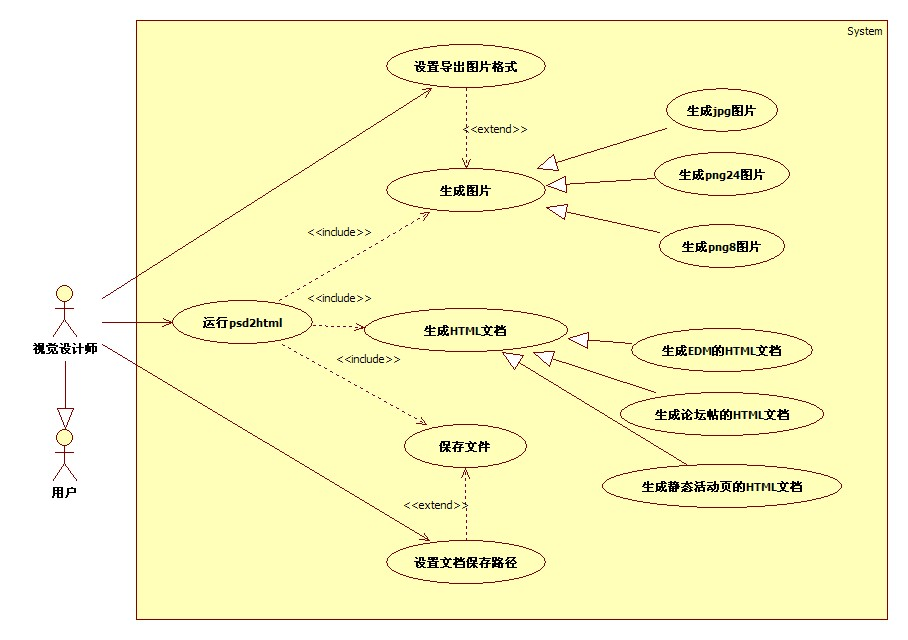
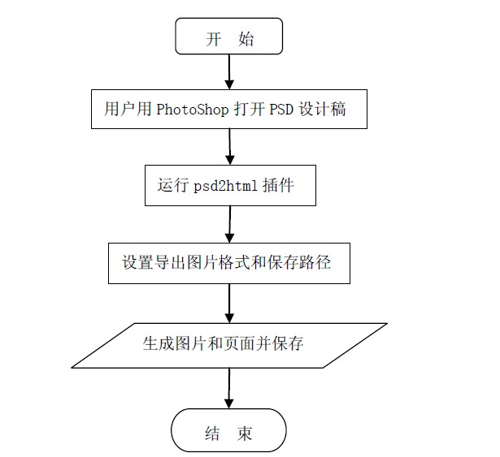
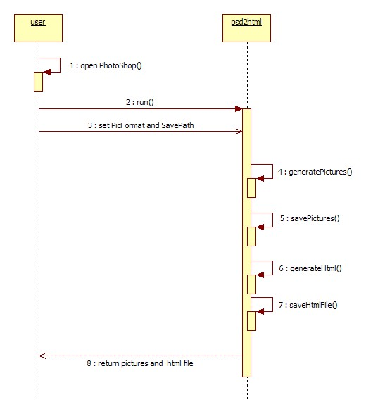

#PSD to HTML功能需求文档(FRD)

目录

1.项目概述	3

1.1.项目背景	3

1.2.主要解决方案	3

1.3. 适用范围	3

1.4.词汇表	3

2.项目目标	3

3.项目涉众	4

4.功能需求	5

4.1.业务图例	5

4.2.功能列表	6

4.2.1.PSD2HTML	7

5.风险分析	8

6.附录	8

<table>
<tr><td>版本	</td><td>更新时间</td><td>更新内容</td><td>作者</td></tr>
<tr><td>1.0.0</td><td>2012-5-18</td><td>初稿</td><td>单丹</td></tr>
<tr><td>1.0.1</td><td>2012-5-24</td><td>1.3  适用范围 需求细化</td><td>单丹</td></tr>
</table>
			
##1. 项目概述

###1.1项目背景

目前运营部门提出的EDM、论坛帖、活动页等需求中，静态页面由视觉设计师开发完成。目前这个过程中存在两个主要问题：
1.	视觉设计师使用Photoshop自带的切片工具生成的页面，存在浏览器兼容性问题
2.	当要求页面上的文字可编辑时，设计师的时间成本会成倍增加

本项目利用Photoshop的插件机制，对上述问题给出了解决方案。

###1.2主要解决方案

利用Photoshop提供的JavaScript API解析PSD图层，获取图层详细信息，生成PSD 图层的Json数据。通过不同的转换器，将Json数据转换成符合需求的HTML页面。

###1.3 适用范围

处理只包含图片图层和单文本片段(text-frame)的文本图层的PSD设计稿，生成HTML页面，该页面特点是：

	1.	活动页面布局通过绝对定位实现，EDM和论坛帖使用table实现
	2.	HTML语义化程度不高
	3.	复用性不高

生成的HTML页面可用于活动页、EDM、论坛帖等对语义化及复用性要求不高的应用场景。
图片和HTML文件满足如下要求：

	1.	每张图片小于100K，如全图小于100K，则切成两张
	2.	图片默认导出格式为jpg，质量80%
	3.	使用嵌入式css。不使用<style>标签
	4.	段落文字使用
。段落文字可供需求方编辑
	5.	要设置高height和宽width
	6.	不使用onMouseOut、onMouseOver属性

对EDM的额外要求：

	1.	每张图片不超过15k
	2.	所有链接在新窗口打开
	3.	不使用float，position定位
	4.	不使用gif，flash，js，iframe
	5.	不在<head>、<meta>、<body>标签上定义样式
	6.	font-* 族的CSS属性不能使用复合属性
	7.	表格不会继承外部的font等属性，需要在每个<td>元素或更里层的元素都定义字体属性和颜色
	8.	不使用标签的style属性设置背景图片，可以使用标签的background属性
	9.	用table表格布局，居中

对论坛帖的额外要求：

	1.	不使用标签的style属性设置背景图片，可以使用标签的background属性
	2.	不使用float，position定位
	3.	可使用的标签集合：<a>、
、<h1>、<h2>、<h3>、<h4>、<h5>、<h6>、、<b>、<i>、<u>、、、<strike>、<strong>、<em>、
、 、<ol>、<li>、<ul>、
、、、<map>、<area>、<marquee>、<table>、<tr>、<td>、<th>、<thead>、<tbody>、<tfoot>、<colgroup>、<col>、<caption>、<bgsound>、<blockquote>、<cite>、<object>、<param>、<video>、<autio>、<small>、<big>、<nobr>、
、<dl>、<dt>、<dd>、<pre>、<listing>、<blink>、<spacer>

###1.4词汇表

词汇解释

	PSD2HTML：由PSD文件生成HTML页面的Photoshop插件
	PSD：Photoshop文档，.psd是Adobe Photoshop软件默认的文件扩展名
	EDM：Email Direct Marketing， 电子邮件营销。网络营销的一种方式。
	论坛帖：本文中特指论坛中通过源码编辑器编辑的帖子。
	活动页：营销活动的页面。生命周期短，不需后期维护。
	转换器：将Json数据转换成HTML页面。不同的页面需求，转换成的html标签及style有一定的差异。

项目目标

	解决设计师在开发静态页面过程中遇到的问题，并使得他们从这种简单、机械性的工作中释放出来。

项目涉众

<table>
<tr><td>涉众角色	</td><td>涉众</td><td>需涉众代表</td><</tr>
<tr><td>需求方</td><td>B2B-CBU-技术部-用户体验部-商业产品设计组</td><td>卢俊</td><</tr>
<tr><td>PD</td><td>单丹</td><td>单丹</td><</tr>
<tr><td>PM</td><td>万先甲</td><td>万先甲</td><</tr>
<tr><td>Dev.</td><td>B2B-CBU-技术部-商业产品开发部-前端开发</td><td>万先甲、肖武明</td><</tr>
<tr><td>Reviewer</td><td>叶周全</td><td>叶周全</td><</tr>
<tr><td>Tester</td><td>史佳丽、曹文文、马俊</td><td>史佳丽</td><</tr>

</table>

##4. 功能需求

###4.1业务图例

图表 4-1 用例图

 图表 4-2 流程图
 
 
图表 4-3 时序图

###4.2 功能列表

<table>
<tr><td>编号	</td><td>功能点</td><td>需求概述</td><td>优先级</td><td>估算成本（人日）</td></tr>
<tr><td>1.1	</td><td>图片图层信息解析</td><td>解析输入的PSD文件中的图片图层信息，并输出</td><td>P1</td><td>5</td></tr>
<tr><td>1.2	</td><td>文本图层信息解析</td><td>解析输入的PSD文件中的文本图层信息，并输出</td><td>P1</td><td>4</td></tr>
<tr><td>1.3	</td><td>图片生成</td><td>生成图片并保存到本地</td><td>P1</td><td>2</td></tr>
<tr><td>1.4	</td><td>HTML文件生成</td><td>HTML文件生成并保存到本地</td><td>P1</td><td>12</td></tr>
<tr><td>1.5	</td><td>浏览器兼容</td><td>生成的HTML页面可以兼容主流浏览器</td><td>P2</td><td>5</td></tr>
<tr><td>2.1	</td><td>图片导出格式可配置</td><td>用户可以选择导出图片的格式</td><td>P3</td><td>1</td></tr>
<tr><td>2.2	</td><td>输出文件目录可配置</td><td>用户可指定输出文件保存目录</td><td>P3</td><td>1</td></tr>
<tr><td>2.3	</td><td>输出页面类型可配置</td><td>用户可指定输出页面类</td><td>P3</td><td>1</td></tr>

</table>

####4.2.1  PSD2HTML

功能描述 

【前置流程】

无

【基本流程】

用户使用Photoshop打开PSD设计稿，运行插件。生成图片和HTML文件并保存在本地。

【后置流程】

无

【分支流程】

1.	当运行出现异常时，给出提示并退出运行。

规则详情

1.	生成的图片质量满足于web应用要求。参见1.3适用范围。

2.	生成的HTML页面质量满足web应用要求。参见1.3适用范围。

##5．风险分析

<table>
<tr><td>风险	</td><td>可能性</td><td>严重性</td><td>应对策略</td><td>应对性</td></tr>
<tr><td>多属性文本图层的解析：目前没发现API可识别单个文本图层中含有不同属性文字的情况</td><td>高</td><td>中</td><td>1.约定设计稿中的不同属性的文本使用不同的文本图层。2.通过图层命名来区别。</td><td>低</td></tr>
<tr><td>带有链接的文本图层的解析：和普通文本图层没有区别</td><td>高</td><td>中</td><td>通过图层命名来区别</td><td>中</td></tr>
<tr><td>对设计稿的约定：造成需求方设计工作繁琐</td><td>中</td><td>中</td><td>1.不做约定，对生成后的页面再根据需求做修改。2.对图层命名或图层内容做相关约定或修改，生成满足需求的页面。</td><td>中</td></tr>
<tr><td>对Photoshop版本有要求</td><td>低</td><td>低</td><td>1.解决兼容性问题。2.安装符合版本要求的PS。</td><td>高</td></tr>
<tr><td>EDM实现存在技术风险</td><td>高</td><td>高</td><td>把文本切成图片</td><td>低</td></tr>
</table>

##6．附录

参考资料：

	http://www.adobe.com/devnet/Photoshop/scripting.html
	http://op.fangdeng.org/docs/mail-template.html
	http://www.chinaemail.com.cn/zixun/corp/201007/52176.html